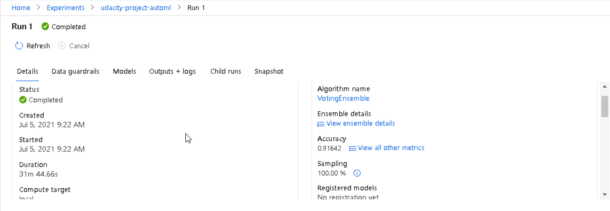

# Optimizing an ML Pipeline in Azure

## Overview
This project is part of the Udacity Azure ML Nanodegree.
In this project, we build and optimize an Azure ML pipeline using the Python SDK and a provided Scikit-learn model.
This model is then compared to an Azure AutoML run.

## Summary

Here we use the <a href='https://automlsamplenotebookdata.blob.core.windows.net/automl-sample-notebook-data/bankmarketing_train.csv'> Bank Marketing </a> dataset. This dataset contains data about individuals who are interested in banking services. The challenge here is to identify patterns of individuals who subscribe to banking services.

 </img>

In this project, we created an ML pipeline to optimize hyperparameters and compare the results.

- Custom coded model (standard Scikit-learn logistic regression) with hyperparameters optimized using HyperDrive
- Build and optimize models on the same dataset using AutoML

The best performing model was the Voting Ensemple model obtained by AutoML, which achieved 91.64% "Accuracy". The results are slightly better than 89.58% of Scikit-Learn.

## Scikit-learn Pipeline

<a href="https://scikit-learn.org/stable/modules/generated/sklearn.linear_model.LogisticRegression.html"> Scikit-Learn's Logistic Regression model </a> is adopted, and hyperparameters are used by Hyperdrive to optimize.

To benefit from the effective use of computational resources, used random sampling to perform the initial search and then narrow down the search space for early termination to improve results.

```
# Specify parameter sampler
ps = RandomParameterSampling( {
    "--C": uniform(0.1, 1.0),
    "--max_iter": choice(range(1, 100))
    }
)
```

This sampling algorithm selects parameter values from a set of discontinuous values or a distribution of contiguous ranges.
C, max_iter are parameters of Logistic Regression.
C returns evenly distributed values between 0.1 and 1.0.
max_iter takes an integer value in the range 1-100.

For early termination here, BanditPolicy here stops the search for optimal values early for poorly performing and unlikely parameters. BanditPolicy defines an early termination policy based on margin criteria, as well as evaluation frequency and delay intervals. 

```
policy = BanditPolicy(slack_factor=0.1, evaluation_interval=2)
```

- slack_factor: Allowable time to perform the best running training. This factor specifies the margin period as a ratio.
- evaluation_interval: Optional. How often to apply the policy. Each time the training script logs it, the primary metric counts as an interval. 

## AutoML

Hyperparameters used in AutoML are defined as below.

```
automl_config = AutoMLConfig(
    experiment_timeout_minutes = 30,
    task = 'classification',
    primary_metric = 'accuracy',
    training_data = pd.concat([X,y], axis = 1),
    #valudation_data = validation_data,
    label_column_name = 'y',
    n_cross_validations = 5)
```

The configuation parameters:

```
- experiement will time out after 30 minutes
- classification models
- Primary metric is "accuracy" among  others for classification ("https://docs.microsoft.com/ja-jp/azure/machine-learning/how-to-configure-auto-train#primary-metric")
- Data is split into the 5 cross validation data sets
```



## Pipeline comparison

The best performing model was the *Voting Ensemble* model obtained by AutoML, which achieved 91.64% "Accuracy". The results are slightly better than 89.58% of Scikit-Learn.

The *Voting Ensemble* model for AutoML selection is the ensemble method using the *XGBoost* algorithm. This model has also obtained better results than the other ensemble methods like *Random Forest* in other experiments I conducted [<a href="https://github.com/HajimeK/machine-learning/blob/master/projects/capstone/report.pdf">Ref</a>]. 

## Future work

We have seen that it is relatively easy to verify multiple models with AutoML and obtain results equivalent to or better than the individual models used with HyperDrive.
We believe that it is necessary to evaluate the validity of the data and to obtain better results in the future.

Regarding the evaluation of data validity, Random data division is performed this time, but the data set is adopted without evaluating data bias and abnormal values. I think we need to update *clean_data* to do *feature engineering* for these data as well.

Also, from the viewpoint of "getting better results in the future", we will tune the hyperparameters of *VotingEnsemble* obtained by *AutoML* to further evaluate the validity of the evaluation of the results of *AutoML*. *Azure ML Studio* provides information on important features. You need to use this information to evaluate the algorithm and evaluate the learning outcomes in comparison with the PCA.
